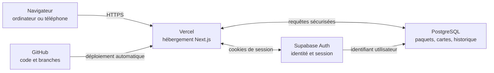
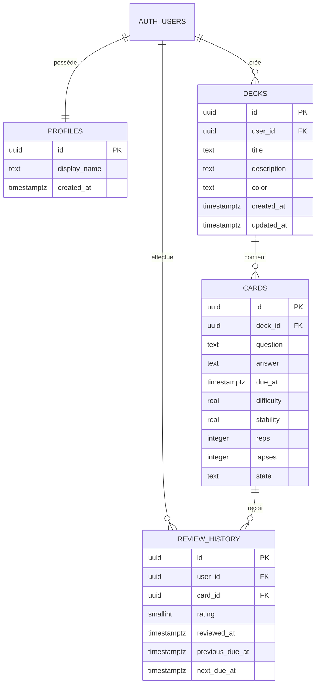

# Interview Trainer

Interview Trainer est une application web personnelle de révision inspirée d’Anki. Elle transforme des questions d’entretien en cartes à revoir régulièrement et synchronise les paquets, les réponses et la progression entre téléphone et ordinateurs.

Le premier contenu métier disponible est un paquet de 50 questions sur les IFRS et les différences entre IFRS et French GAAP.

> État du projet : MVP fonctionnel, hébergé sur Vercel et connecté à Supabase. L’application n’est pas destinée à être publiée sur l’App Store ; elle s’utilise directement dans un navigateur.

## Sommaire

- [Fonctionnalités](#fonctionnalités)
- [Parcours utilisateur](#parcours-utilisateur)
- [Architecture générale](#architecture-générale)
- [Stack technologique](#stack-technologique)
- [Rôle des services et connecteurs](#rôle-des-services-et-connecteurs)
- [Modèle de données](#modèle-de-données)
- [Authentification et sessions](#authentification-et-sessions)
- [Répétition espacée](#répétition-espacée)
- [Types de questions](#types-de-questions)
- [Mode de prévisualisation](#mode-de-prévisualisation)
- [Structure du dépôt](#structure-du-dépôt)
- [Installation locale](#installation-locale)
- [Configuration de Supabase](#configuration-de-supabase)
- [Déploiement avec Vercel](#déploiement-avec-vercel)
- [Workflow Git et publication](#workflow-git-et-publication)
- [Sécurité](#sécurité)
- [Dépannage](#dépannage)
- [Limites actuelles et évolutions possibles](#limites-actuelles-et-évolutions-possibles)

## Fonctionnalités

### Tableau de bord

- session du jour constituée des cartes arrivées à échéance ;
- question affichée avant la réponse ;
- révélation manuelle de la réponse ;
- évaluation en quatre niveaux : **À revoir**, **Difficile**, **Bien** et **Facile** ;
- mise à jour immédiate de la progression ;
- liste des paquets et nombre de cartes à revoir ;
- création rapide d’un paquet ou d’une carte ;
- interface responsive pour ordinateur et téléphone.

### Paquets et cartes

- création de paquets personnalisés ;
- ajout et suppression de cartes ;
- page détaillée et scrollable pour chaque paquet ;
- classement des questions par format et difficulté ;
- paquet initial IFRS & French GAAP de 50 cartes ;
- suppression en cascade : supprimer un paquet supprime ses cartes associées.

### Profil et statistiques

- nombre total de cartes, cartes jouées et cartes non jouées ;
- résultats par niveau de réponse ;
- activité récente ;
- répartition par paquet ;
- répartition par type de question ;
- filtres de période et de paquet.

### Navigation

- pages principales **Aujourd’hui**, **Mes paquets** et **Mon profil** ;
- barre latérale persistante sur ordinateur ;
- navigation adaptée au mobile ;
- menu contextuel du profil avec accès aux statistiques et déconnexion.

## Parcours utilisateur

1. L’utilisateur se connecte à son espace.
2. Il crée un paquet ou installe le paquet IFRS proposé.
3. Il ajoute des questions et leurs réponses.
4. Les cartes arrivées à échéance apparaissent dans la session du jour.
5. Il essaie de répondre, puis révèle la réponse.
6. Il évalue sa maîtrise de la carte.
7. L’application calcule la prochaine date de révision et conserve le résultat.
8. La page **Mon profil** agrège l’historique pour afficher la progression.

## Architecture générale



Le navigateur affiche l’interface React. Next.js prépare les pages et récupère les données côté serveur lorsque cela est pertinent. Supabase fournit l’identité de l’utilisateur et la base PostgreSQL. Vercel construit et héberge chaque version provenant de GitHub.

## Stack technologique

| Élément | Technologie | Rôle |
| --- | --- | --- |
| Framework web | Next.js 16, App Router | Pages, routes serveur, rendu et navigation |
| Interface | React 19 | Composants interactifs et état local |
| Langage | TypeScript | Typage et détection d’erreurs avant déploiement |
| Styles | Tailwind CSS 4 + CSS personnalisé | Mise en page, responsive et charte graphique |
| Icônes | Lucide React | Icônes cohérentes et légères |
| Authentification | Supabase Auth | Comptes, sessions et récupération d’accès |
| Base de données | Supabase PostgreSQL | Stockage synchronisé des données |
| Sécurité des données | Row Level Security | Isolation des données entre utilisateurs |
| Hébergement | Vercel | Builds, production et prévisualisations |
| Code source | GitHub | Historique Git, branches et pull requests |
| Gestionnaire de paquets | pnpm | Installation et exécution des dépendances |

## Rôle des services et connecteurs

### GitHub : la source de vérité du code

Le dépôt GitHub contient le code, les migrations de base de données et cette documentation. Chaque modification importante passe par une branche et une pull request. GitHub conserve l’historique, permet de relire le changement et déclenche Vercel.

GitHub ne contient ni les données personnelles de révision ni les clés secrètes de production.

### Vercel : l’hébergement de l’application

Vercel est relié au dépôt GitHub :

- un changement envoyé sur une branche crée une URL de prévisualisation ;
- une fusion dans `main` déclenche le déploiement de production ;
- les variables d’environnement sont configurées dans les réglages du projet Vercel ;
- Vercel exécute le build Next.js et signale son résultat dans la pull request.

URL de production actuelle : [interview-trainer-zeta.vercel.app](https://interview-trainer-zeta.vercel.app)

### Supabase : le backend géré

Supabase regroupe plusieurs fonctions qui nécessiteraient autrement un serveur dédié :

- **Auth** identifie l’utilisateur et gère sa session ;
- **PostgreSQL** stocke les paquets, cartes et révisions ;
- **API automatique** permet au client Supabase de lire et modifier les tables ;
- **Row Level Security (RLS)** vérifie que chaque utilisateur ne manipule que ses propres données ;
- **SQL Editor** permet d’exécuter les migrations et d’inspecter la base.

Supabase n’est pas une base de données graphe. Le projet utilise une base relationnelle PostgreSQL : les tables sont reliées par des identifiants et des clés étrangères.

### Relations entre les services

| Connexion | Ce qui circule | Ce qui ne doit jamais circuler |
| --- | --- | --- |
| GitHub → Vercel | code et commits | mots de passe ou fichiers `.env.local` |
| Application → Supabase Auth | identifiants et jetons de session | clé serveur privilégiée dans le navigateur |
| Application → PostgreSQL | données autorisées par RLS | données d’un autre utilisateur |
| Vercel → navigateur | pages, JavaScript et configuration publique | secrets administrateur Supabase |

## Modèle de données

La migration de référence se trouve dans [`supabase/migrations/20260910150000_initial_schema.sql`](supabase/migrations/20260910150000_initial_schema.sql).



### Tables

- `profiles` : informations d’affichage associées à un utilisateur Supabase ;
- `decks` : paquets appartenant à un utilisateur ;
- `cards` : questions contenues dans un paquet, avec leur état de révision ;
- `review_history` : journal immuable des évaluations permettant de produire les statistiques.

Un trigger crée automatiquement un profil lorsqu’un utilisateur est ajouté dans `auth.users`.

### Notes de compatibilité

La colonne `cards.answer` accepte deux formats :

- un ancien texte simple, toujours lisible ;
- une structure JSON préfixée par `__IT_V1__`, utilisée pour enregistrer le type, la difficulté, les choix et la bonne réponse.

Cette stratégie permet d’ajouter les QCM sans migration destructive et sans casser les cartes déjà créées.

## Authentification et sessions

### Version actuellement sur `main`

La production utilise une connexion sans mot de passe par email. Supabase envoie un lien unique, la route `/auth/callback` échange son code contre une session, puis le navigateur revient sur l’application.

### Évolution proposée

La pull request [#3](https://github.com/pmvillazdata/interview-trainer/pull/3) ajoute :

- connexion par email et mot de passe ;
- création de compte ;
- création ou récupération du mot de passe par email ;
- compatibilité avec le gestionnaire Mots de passe d’Apple ;
- conservation et renouvellement de la session sur l’appareil.

Après fusion, un utilisateur existant devra utiliser une fois **Mot de passe oublié ou à créer**, définir son mot de passe, puis se connecter normalement. Une reconnexion peut rester nécessaire après suppression des cookies, utilisation de la navigation privée, révocation de session ou changement d’appareil sans synchronisation du gestionnaire de mots de passe.

### Cycle de session

Le proxy Next.js appelle Supabase pour rafraîchir la session à partir des cookies. Les pages protégées vérifient ensuite l’utilisateur côté serveur. Une déconnexion locale invalide la session du navigateur concerné.

## Répétition espacée

Après révélation de la réponse, l’utilisateur choisit une note de 1 à 4 :

| Choix | Note stockée | Prochaine révision | État de la carte |
| --- | ---: | --- | --- |
| À revoir | 1 | environ 10 minutes | `relearning` |
| Difficile | 2 | 2 jours | `review` |
| Bien | 3 | 6 jours | `review` |
| Facile | 4 | 12 jours | `review` |

Chaque réponse :

1. met à jour `due_at`, `reps`, `lapses` et `state` sur la carte ;
2. crée une ligne dans `review_history` ;
3. retire la carte de la session affichée ;
4. alimente les statistiques du profil.

Le moteur actuel utilise des intervalles fixes. Les colonnes `difficulty` et `stability` préparent une future évolution vers un algorithme adaptatif comme FSRS.

## Types de questions

### Réponse à révéler

L’utilisateur formule sa réponse mentalement ou à voix haute, puis révèle les points clés et évalue sa maîtrise.

### Choix multiple

La carte contient plusieurs propositions, l’indice de la bonne réponse et une explication facultative.

### Difficultés

Chaque question peut être marquée **Débutant**, **Intermédiaire** ou **Avancé**. Il s’agit actuellement d’une métadonnée éditoriale distincte de la difficulté calculée par un futur moteur de répétition espacée.

## Mode de prévisualisation

Les déploiements Vercel de type `preview` utilisent un profil de test **QA** avec des données de démonstration. Ce mode permet de parcourir le tableau de bord, les paquets et le profil sans envoyer d’email ni utiliser de vraies données.

Le mode visite est également activé en l’absence de configuration Supabase. Les pages de paquet y sont en lecture seule afin d’éviter de donner l’impression que des modifications fictives seront sauvegardées.

Ce comportement est défini dans `src/data/preview-data.ts` :

```text
Vercel Preview ou configuration Supabase absente
                    ↓
          données QA locales et sûres
                    ↓
     navigation complète, écritures désactivées
```

## Structure du dépôt

```text
interview-trainer/
├── src/
│   ├── app/
│   │   ├── auth/callback/       # échange du code Auth contre une session
│   │   ├── decks/[id]/          # page détaillée d’un paquet
│   │   ├── login/               # connexion
│   │   ├── profile/             # statistiques du profil
│   │   ├── globals.css          # charte et styles globaux
│   │   └── page.tsx             # chargement serveur du tableau de bord
│   ├── components/
│   │   ├── dashboard.tsx        # révision, bibliothèque et navigation
│   │   ├── deck-detail.tsx      # gestion des questions d’un paquet
│   │   └── profile-dashboard.tsx # filtres et visualisations
│   ├── data/
│   │   ├── ifrs-deck.ts         # paquet IFRS initial
│   │   └── preview-data.ts      # données du profil QA
│   ├── lib/
│   │   ├── supabase/            # clients navigateur, serveur et proxy
│   │   ├── question-content.ts  # encodage des formats de questions
│   │   └── types.ts             # types TypeScript partagés
│   └── proxy.ts                 # renouvellement des cookies Auth
├── supabase/migrations/         # schéma SQL et politiques RLS
├── .env.example                 # variables publiques attendues
├── package.json                 # scripts et dépendances
└── README.md                    # documentation du projet
```

## Installation locale

### Prérequis

- Node.js récent compatible avec Next.js 16 ;
- pnpm ;
- un projet Supabase pour travailler avec de vraies données.

### Démarrage rapide

```bash
git clone https://github.com/pmvillazdata/interview-trainer.git
cd interview-trainer
pnpm install
cp .env.example .env.local
pnpm dev
```

Ouvrir ensuite [http://localhost:3000](http://localhost:3000).

Sans variables Supabase, l’application démarre en mode de démonstration. Cela permet de travailler sur l’interface, mais pas de sauvegarder de vraies données.

### Commandes utiles

```bash
pnpm dev      # serveur local avec rechargement automatique
pnpm lint     # contrôle de qualité ESLint
pnpm build    # build complet équivalent à la préparation de production
pnpm start    # exécute localement un build déjà produit
```

Avant chaque pull request, exécuter au minimum `pnpm lint` et `pnpm build`.

## Configuration de Supabase

### 1. Créer le schéma

Dans le SQL Editor Supabase, exécuter le contenu de :

```text
supabase/migrations/20260910150000_initial_schema.sql
```

La migration crée les tables, index, clés étrangères, politiques RLS et le trigger de création de profil.

### 2. Configurer les variables locales

Créer `.env.local` à partir de `.env.example` :

```dotenv
NEXT_PUBLIC_SUPABASE_URL=https://your-project.supabase.co
NEXT_PUBLIC_SUPABASE_PUBLISHABLE_KEY=your-publishable-key
```

La clé `publishable` est conçue pour être utilisée dans le navigateur. La sécurité des données ne repose pas sur le secret de cette clé, mais sur l’authentification et les politiques RLS. Une clé `service_role`, en revanche, ne doit jamais être placée dans une variable `NEXT_PUBLIC_*`.

### 3. Configurer les URL d’authentification

Dans **Authentication → URL Configuration** :

- Site URL de production : `https://interview-trainer-zeta.vercel.app`
- Redirect URL locale : `http://localhost:3000/auth/callback`
- Redirect URL de production : `https://interview-trainer-zeta.vercel.app/auth/callback`

Si l’authentification doit être testée sur des domaines Vercel temporaires, ajouter uniquement le motif de prévisualisation nécessaire plutôt qu’un domaine trop large.

### 4. Emails Supabase

Le service email intégré est adapté aux essais, mais son quota est volontairement très faible. Pour un usage plus large ou une meilleure délivrabilité, configurer un fournisseur SMTP dans Supabase.

## Déploiement avec Vercel

1. Importer le dépôt GitHub dans Vercel.
2. Sélectionner Next.js comme framework.
3. Ajouter les deux variables Supabase dans les environnements nécessaires.
4. Déployer.
5. Reporter l’URL Vercel dans la configuration Auth de Supabase.

### Environnements

| Environnement | Déclencheur | Données attendues |
| --- | --- | --- |
| Local | `pnpm dev` | Supabase réel si `.env.local` existe, sinon démo |
| Preview | branche ou pull request | profil QA, navigation de test |
| Production | fusion dans `main` | authentification et données Supabase réelles |

## Workflow Git et publication

Workflow recommandé :

1. partir de la dernière version de `main` ;
2. créer une branche au nom explicite ;
3. effectuer une modification cohérente et limitée ;
4. lancer lint et build ;
5. envoyer la branche sur GitHub ;
6. ouvrir une pull request vers `main` ;
7. tester la prévisualisation Vercel ;
8. fusionner seulement après validation ;
9. vérifier le déploiement de production.

Exemples de branches :

```text
develop_auth_password
develop_deck_filters
fix_mobile_navigation
docs_project_guide
```

## Sécurité

### Row Level Security

Toutes les tables applicatives ont RLS activé. Les politiques vérifient `auth.uid()` :

- un utilisateur ne peut gérer que son profil ;
- un paquet n’est accessible qu’à son propriétaire ;
- une carte est accessible uniquement si son paquet appartient à l’utilisateur ;
- l’historique est limité à l’utilisateur connecté.

### Bonnes pratiques du projet

- ne jamais committer `.env.local` ;
- ne jamais publier de clé `service_role` ;
- conserver les vérifications côté serveur sur les pages privées ;
- valider les destinations de redirection Auth ;
- tester les politiques RLS lorsqu’une nouvelle table est ajoutée ;
- utiliser le profil QA pour les démonstrations plutôt qu’un vrai compte ;
- révoquer et remplacer immédiatement toute véritable clé secrète exposée.

## Dépannage

### Le lien reçu ouvre `localhost:3000`

Vérifier la **Site URL**, les **Redirect URLs** et les modèles d’emails dans Supabase. Demander ensuite un nouveau lien : un ancien email conserve son ancienne destination.

### « Impossible d’envoyer le lien »

Le fournisseur email intégré de Supabase applique un quota très faible et un délai entre deux demandes. Patienter, utiliser uniquement le dernier email ou configurer un SMTP personnalisé.

### « URL and Key are required »

Les variables Supabase manquent dans l’environnement Vercel concerné. Vérifier leur nom exact, leur portée Preview/Production, puis redéployer.

### La prévisualisation affiche le profil QA

C’est volontaire. Les previews sont navigables sans authentification afin de tester l’interface sans toucher aux données personnelles.

### Une page privée renvoie vers `/login`

La session est absente ou expirée. Se reconnecter. Si le problème persiste, vérifier les cookies du domaine et les journaux Auth de Supabase.

### Une écriture échoue malgré une session valide

Inspecter d’abord les politiques RLS, puis confirmer que les identifiants `user_id` et `deck_id` correspondent bien à l’utilisateur connecté.

### Le build Vercel échoue

Reproduire localement avec :

```bash
pnpm lint
pnpm build
```

Corriger l’erreur localement avant de relancer le déploiement.

## Limites actuelles et évolutions possibles

- le moteur de répétition utilise des intervalles fixes ;
- les paquets ne peuvent pas encore être partagés ;
- aucune importation Anki/CSV n’est disponible ;
- les médias et pièces jointes ne sont pas encore gérés ;
- l’édition complète d’une carte existante peut être enrichie ;
- les tests automatisés end-to-end restent à ajouter ;
- les statistiques peuvent gagner des comparaisons temporelles ;
- un algorithme FSRS pourrait utiliser réellement `difficulty` et `stability` ;
- une Progressive Web App pourrait améliorer l’installation sur téléphone et le fonctionnement hors ligne.

## Principes produit

Le projet suit quelques règles simples :

- une session doit pouvoir commencer en quelques secondes ;
- l’interface doit rester calme, légère et lisible ;
- les données appartiennent à l’utilisateur ;
- les modifications doivent être testables en preview avant production ;
- la compatibilité avec les anciennes cartes doit être préservée ;
- l’infrastructure doit rester proportionnée à une application personnelle.

---

Projet personnel maintenu dans [`pmvillazdata/interview-trainer`](https://github.com/pmvillazdata/interview-trainer).
